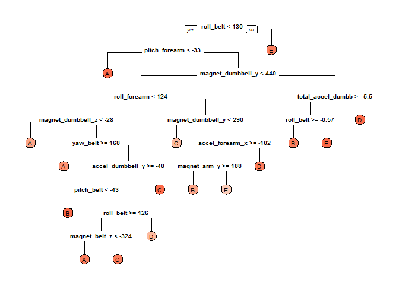

```r
library(readr)
library(dplyr)
library(caret)
library(ggplot2)
library(purrr)
library(rpart.plot)
set.seed(42)
```

###Overview
Using devices such as Jawbone Up, Nike FuelBand, and Fitbit it is now possible to collect a large amount of data about personal activity relatively inexpensively. In this project, we will use data from accelerometers on the belt, forearm, arm, and dumbell of 6 participants. They were asked to perform barbell lifts correctly and incorrectly in 5 different ways. The goal of this project is to predict the manner in which they did the exercise. This is the "classe" variable in the training set.

###Data processing
#####Original datasets:

* [Training data](https://d396qusza40orc.cloudfront.net/predmachlearn/pml-training.csv)

* [Test data](https://d396qusza40orc.cloudfront.net/predmachlearn/pml-testing.csv)

#####Load datasets

```r
rd.file <- "./Datasets.RData"
if (file.exists(rd.file)) {
     load(file = rd.file, verbose = TRUE)
} else {
     if (!file.exists("./data")) {
          dir.create("./data")
     }
     
     if (!file.exists("./data/pml-training.csv")) {
          download.file(
               "https://d396qusza40orc.cloudfront.net/predmachlearn/pml-training.csv",
               "./data/pml-training.csv"
          )
     }
     
     if (!file.exists("./data/pml-testing.csv")) {
          download.file(
               "https://d396qusza40orc.cloudfront.net/predmachlearn/pml-testing.csv",
               "./data/pml-testing.csv"
          )
     }
     
     col.types <- paste0(gsub("\\d+", "", paste0("n", 1:160)))
     col.types[1] <- "-"
     col.types[c(2:7, 160)] <- "c"
     col.types <- paste(col.types, collapse = "")
     
     train.df <-
          read_csv("./data/pml-training.csv", col_types = col.types)
     test.df <- read_csv("./data/pml-testing.csv", col_types = col.types)
     rm(col.types)
     
     fctr.vec <- c("classe", "user_name", "new_window")
     train.df <- modify_at(train.df, fctr.vec, as.factor)
     test.df <- modify_at(test.df, fctr.vec, as.factor)
     rm(fctr.vec)
     
     save(train.df, test.df, file = rd.file)
}
rm(rd.file)
```

#####Data overview

```r
#variables class
map_chr(test.df, class) %>% table()
```

```
## .
## character    factor   numeric 
##         5         2       152
```

```r
#how many observations and variables
dim(train.df)
```

```
## [1] 19622   159
```

```r
dim(test.df)
```

```
## [1]  20 159
```

```r
#possible values of target variable
levels(train.df$classe)
```

```
## [1] "A" "B" "C" "D" "E"
```

```r
#map_int(train.df, function(x) sum(is.na(x))) %>% keep(~.>0)
#map_int(test.df, function(x) sum(is.na(x))) %>% keep(~.>0)
```

#####Create custom datasets
Create xy datasets and drop all non-numeric variables.

```r
train.x <- select_if(train.df, is.numeric)
train.y <- train.df$classe

validation.x <- select_if(train.df, is.numeric)
validation.y <- train.df$classe

test.x <- select_if(test.df, is.numeric)

#map_chr(train.df, class) %>% keep(~.=="character")
```

#####Handling missing data
100 variables in our training and test datasets contains missing values. Most of machine learning algorithms require a non missing values and we need to use some methods to handle NA values in our datasets. So widely used solution is something like this:

1. look at distributions of NA and use deletion strategy to drop vaiables if the data is missing for more than 60% observations
2. apply median or kNN imputation method for remaining variables
3. identify near zero-variance variables and drop them too


```r
#proportions of missing values in each variable
train.na.prop <- train.x %>% 
     map_dbl(~mean(is.na(.))) %>% 
     keep(~.>0) %>% 
     as_tibble() %>% 
     tibble::rownames_to_column()
nrow(train.na.prop)
```

```
## [1] 100
```

```r
test.na.prop <- test.x %>% 
     map_dbl(~mean(is.na(.))) %>% 
     keep(~.>0) %>% 
     as_tibble() %>% 
     tibble::rownames_to_column()
nrow(test.na.prop)
```

```
## [1] 100
```

```r
train.x <- select(train.x, -one_of(filter(train.na.prop, value>0.6)$rowname))
test.x <- select(test.x, -one_of(filter(test.na.prop, value>0.6)$rowname))

train.x %>% map_dbl(~mean(is.na(.))) %>% keep(~.>0)
```

```
## named numeric(0)
```

```r
test.x %>% map_dbl(~mean(is.na(.))) %>% keep(~.>0)
```

```
## named numeric(0)
```

```r
#no NA after 1st step, skip step 2

#show nzv columns
nearZeroVar(train.x, saveMetrics = TRUE) %>% tibble::rownames_to_column() %>% filter(zeroVar | nzv)
```

```
## [1] rowname       freqRatio     percentUnique zeroVar       nzv          
## <0 rows> (or 0-length row.names)
```

```r
nearZeroVar(test.x, saveMetrics = TRUE) %>% tibble::rownames_to_column() %>% filter(zeroVar | nzv)
```

```
## [1] rowname       freqRatio     percentUnique zeroVar       nzv          
## <0 rows> (or 0-length row.names)
```

```r
#nothing to drop 
rm(train.na.prop)
rm(test.na.prop)
```

#####Separate training dataset into 80/20 training and validation datasets

```r
index.train <- createDataPartition(train.df$classe, p=0.8, list=FALSE)
train.x <- train.x[index.train,]
train.y <- train.y[index.train]

validation.x <- train.x[-index.train,]
validation.y <- train.y[-index.train]
rm(index.train)
```

#####Methods for modelling
Cause our variable of interest is categorical variable with five classes our task is called a Multiclass Classification. And commonly used methods in this case are:

* Decision trees
* Random forests or random decision forests
* Support vector machines

In my project I used only `Decision trees` and `Random Forests`.

#####Decision trees
Fit decision tree with 10-fold cross-validation :

```r
model.dtree <- train(x = train.x, 
                     y = train.y, 
                     method = "rpart",
                     trControl = trainControl(method = "cv", 
                                              number = 10), 
                     tuneLength = 10)

model.dtree
```

```
## CART 
## 
## 15699 samples
##    52 predictor
##     5 classes: 'A', 'B', 'C', 'D', 'E' 
## 
## No pre-processing
## Resampling: Cross-Validated (10 fold) 
## Summary of sample sizes: 14129, 14129, 14130, 14128, 14130, 14130, ... 
## Resampling results across tuning parameters:
## 
##   cp          Accuracy   Kappa    
##   0.01388518  0.6777541  0.5933957
##   0.01548732  0.6711275  0.5854052
##   0.01851357  0.6599140  0.5718127
##   0.01931464  0.6532903  0.5638714
##   0.02064976  0.6365381  0.5435025
##   0.02176235  0.6005523  0.4915915
##   0.02839341  0.5274274  0.3835323
##   0.03702715  0.4997801  0.3464546
##   0.05978341  0.4247940  0.2246296
##   0.11401869  0.3231979  0.0592089
## 
## Accuracy was used to select the optimal model using the largest value.
## The final value used for the model was cp = 0.01388518.
```

Accuracy of this model is about 68%.

Plot model:

```r
prp(model.dtree$finalModel, box.palette = "Reds", branch = 1)
```

<!-- -->

Prediction on validation dataset:

```r
predicted.model.dtree <- predict(model.dtree, newdata = validation.x)
confusionMatrix(predicted.model.dtree, validation.y)
```

```
## Confusion Matrix and Statistics
## 
##           Reference
## Prediction   A   B   C   D   E
##          A 685 113   7  46  17
##          B  17 301  51  12  37
##          C  65  81 424  73  61
##          D 102  84  64 368  98
##          E  14  17  15  22 363
## 
## Overall Statistics
##                                           
##                Accuracy : 0.6825          
##                  95% CI : (0.6659, 0.6988)
##     No Information Rate : 0.2815          
##     P-Value [Acc > NIR] : < 2.2e-16       
##                                           
##                   Kappa : 0.5999          
##  Mcnemar's Test P-Value : < 2.2e-16       
## 
## Statistics by Class:
## 
##                      Class: A Class: B Class: C Class: D Class: E
## Sensitivity            0.7758  0.50503   0.7558   0.7063   0.6302
## Specificity            0.9188  0.95396   0.8913   0.8670   0.9734
## Pos Pred Value         0.7892  0.72010   0.6023   0.5140   0.8422
## Neg Pred Value         0.9127  0.89150   0.9437   0.9368   0.9213
## Prevalence             0.2815  0.18999   0.1788   0.1661   0.1836
## Detection Rate         0.2184  0.09595   0.1352   0.1173   0.1157
## Detection Prevalence   0.2767  0.13325   0.2244   0.2282   0.1374
## Balanced Accuracy      0.8473  0.72949   0.8235   0.7867   0.8018
```

#####Random forests

```r
model.rf <- train(x = train.x,
                  y = train.y,
                  method = "rf",
                  trControl = trainControl(method = "cv",
                                           number = 10),
                  tuneGrid = expand.grid(.mtry=7),
                  allowParallel=TRUE)

model.rf
```

```
## Random Forest 
## 
## 15699 samples
##    52 predictor
##     5 classes: 'A', 'B', 'C', 'D', 'E' 
## 
## No pre-processing
## Resampling: Cross-Validated (10 fold) 
## Summary of sample sizes: 14130, 14129, 14129, 14130, 14128, 14131, ... 
## Resampling results:
## 
##   Accuracy   Kappa    
##   0.9959867  0.9949233
## 
## Tuning parameter 'mtry' was held constant at a value of 7
```

```r
predicted.model.rf <- predict(model.rf, newdata = validation.x)
confusionMatrix(predicted.model.rf, validation.y)
```

```
## Confusion Matrix and Statistics
## 
##           Reference
## Prediction   A   B   C   D   E
##          A 883   0   0   0   0
##          B   0 596   0   0   0
##          C   0   0 561   0   0
##          D   0   0   0 521   0
##          E   0   0   0   0 576
## 
## Overall Statistics
##                                      
##                Accuracy : 1          
##                  95% CI : (0.9988, 1)
##     No Information Rate : 0.2815     
##     P-Value [Acc > NIR] : < 2.2e-16  
##                                      
##                   Kappa : 1          
##  Mcnemar's Test P-Value : NA         
## 
## Statistics by Class:
## 
##                      Class: A Class: B Class: C Class: D Class: E
## Sensitivity            1.0000     1.00   1.0000   1.0000   1.0000
## Specificity            1.0000     1.00   1.0000   1.0000   1.0000
## Pos Pred Value         1.0000     1.00   1.0000   1.0000   1.0000
## Neg Pred Value         1.0000     1.00   1.0000   1.0000   1.0000
## Prevalence             0.2815     0.19   0.1788   0.1661   0.1836
## Detection Rate         0.2815     0.19   0.1788   0.1661   0.1836
## Detection Prevalence   0.2815     0.19   0.1788   0.1661   0.1836
## Balanced Accuracy      1.0000     1.00   1.0000   1.0000   1.0000
```

Here accuracy is better, and I choose this model to predict on test dataset:

```r
predict(model.rf, newdata = test.x)
```

```
##  [1] B A B A A E D B A A B C B A E E A B B B
## Levels: A B C D E
```
